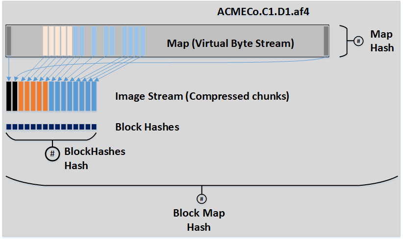

# AFF4 Standard v1.0a 
## Summary

This document is intended for implementers of the Advanced Forensic Format v4 (AFF4), and is to be read as an explanation of the AFF4 Canonical Reference Images v1.0 available via the AFF4 GitHub [https://github.com/aff4/](https://github.com/aff4/) .

The AFF4 is a next-generation forensic container format supporting features such as:
- Storage virtualisation
- Arbitrary metadata storage
- Extensible compression and hashing schemes
- Throughput scalable to high IO rates

Where there is ambiguity or difference between what is stated in this document and the Reference Images, the reference images take precedence. Accordingly, this document may be updated to resolve any such differences. 

In the AFF4, forensic images are stored in a “Container”, which generally is a single ZIP64 based file or a folder. Arbitrary metadata is stored using an RDF data model within the container, in a file called information.turtle. Image content is stored using two abstractions, the Map (a virtual address space) and the Image Stream (a seekable, contiguous sequence of fixed sized data blocks, optionally compressed). Various Virtual Streams exist for representing common block sequences such as sparse (all 0x00) streams.  

Readers are encouraged to read the original research papers which proposed the format for  background and terminology [1][2][3]. 

## Document Information

| | |
| --- | --- |
| Authors | Bradley L Schatz <bradley@schatzforensic.com> , Michael I Cohen <scudette@google.com>  |
| Abstract | Specification for the Advanced Forensic Format 4, Version 1.0 |
| Classification | Public |
| Keywords | AFF4, Advanced Forensic Format, Forensic Image |

## License
Copyright (C) 2016-2017, Bradley Schatz <bradley@schatzforensic.com> & Michael Cohen <scudette@google.com>. Permission is granted to copy, distribute and/or modify this document under the terms of the GNU Free Documentation License, Version 1.3 or any later version published by the Free Software Foundation; with no Invariant Sections, no Front-Cover Texts, and no Back-Cover Texts. A copy of the license may be downloaded from https://www.gnu.org/licenses/fdl-1.3.en.html 

## Revision history

| Revision | Author | Section | Date | Comments |
| --- | --- | --- | --- | --- |
| 1.0 | BL Schatz, MI Cohen | | March 2017 | Initial release |
| 1.0a | BL Schatz | 6.2 | Feb 2022 | Fix typo in blockMapHash construction |
| 1.0a | BL Schatz | 6.3 | Feb 2022 | Document mapPath segment |
| 1.0a | BL Schatz | 3.2 | Feb 2022 | Clarify padding of ImageStream Chunks |
| 1.0a | BL Schatz | 7 | Feb 2022 | Add Striped Image (Multi-ZIP Container) construction and interpretation|

## Acknowledgements
The authors would like to thank Joe Sylve for his feedback on early revisions of this specification, Simson Garfinkel for his initial involvement in the project, and the organisers of the DFRWS conference for providing a forum which nurtured the research behind to this work. 

## 1. Container Versioning
The container version is stored in a text file. Text file is name value pairs, separated by “=”, line endings either CRLF or CR or LF. Ordering of name value pairs is arbitrary.

```
major=1\n
minor=0\n
tool=libaff4 0.9\n
```

The tool line is vendor specific in order to indicate the producing tool.
For AFF4 Standard v1.0, Major is 1, Minor is 0. 

The primary purpose of the version file is for bootstrapping and enabling support for backwards incompatible changes in future. Vendors should only encode in the version file information that would be used by implementations to detect non-standard deviations from the AFF4 standard.

### 1.1 Naming
Versioning information stored in the root of the container with name version.txt

## 2. Storage Information Model
The RDF namespace to be used for v1.0 is http://aff4.org/Schema# , shorthand prefixed as “aff4”

The naming convention for properties and classes is to follow RDF/OWL best practice of using CamelCase, with leading capitalisation for Classes and leading lower case for properties. 

## 2.1 Base Classes

| Name | Purpose | 
| --- | --- |
| Map | Virtual Address Space|
| ImageStream | Storage of image data chunks |
| Image | Representing an image. |
| ContiguousImage | Representing a contiguous image (subclass of Image). |
| DiskImage | Representing a disk image (subclass of ContiguousImage. |

Compliant implementations must RDF multiple type semantics for storing types. For example, if representing a Disk Image, the rdf:type would include the parent types to aff4:DiskImage in addition to aff4:DiskImage (aff4:ContiguousImage and aff4:Image).

## 2.2 Base Properties

| Name | Context | Purpose |
| --- | --- | --- |
| size | ImageStream, Map | The length of the stream. |
| chunkSize | ImageStream | The chunk size |
| chunksInSegment | ImageStream | Number of chunks per segment |
| compressionMethod | ImageStream | The compression algorithm possibly applied to chunks |
| mapGapDefaultStream | Map | The stream to be used to implicitly fill any discontinuities found in a Discontigouous Map stream. |
| fileName | Any segment URI | |
| dataStream | Image or subclass of Image | The Map or ImageStream which corresponds to the bytestream of the Image |
| dependentStream | Map | Child ImageStream’s that are used for block storage |
| target | ImageStream, Map | Backwards pointer to the parent of this object. |
| stored | Map, ImageStream | The Volume that the Image Stream or Map is stored in. |
| hash | Image | The hash of the stream. |

## 3. Image Stream
The original AFF4 offset based image stream is deprecated, replaced by a derivative design. The only change is in the format of the chunk index. The type of an Image Stream is aff4:ImageStream. The ImageStream employs n index entries for n stored chunks.

The index entry has the following structure.
```
struct index_entry {
   bevy offset: u64
   chunk size: u32 
}
```

The bevvy index has the following structure

```
struct index_entry index[bevy_size];
```

### 3.1 Naming
Chunk storage (Bevy’s) are named per [1]. Bevy Index Segments are named with a .index extension to the base Bevy name.

### 3.2 Compression
Storage of uncompressed chunks is supported by the simple principle that if len(chunk) == aff4:chunk_size then it is a stored chunk. Compression is not applied to stored chunks. 

The following algorithm is provided as guidance to writer implementations. 
```
compressedBytes = compress(chunkBytes)
compressedLen  = len(compressedBytes)
if (compressedLen < (chunkSize – 16))  
	write(compressedBytes)
	// store indexe
else
	write(chunkBytes)
	// store index
```
The following algorithm is provided as guidance to reaer implementations. 
```
len = index[i+1] – index[i]
offset = index[i]

if (len == chunkSize)
	chunkBytes = read(base + offset, len)
else
	compressedBytes = read(base +offset, len)
	chunkBytes = decompress(compressedBytes)
```

The in situations where the length of an Image Stream is not modulo aff4:chunkSize, the final chunk WILL be padded with \\00. An implementation WILL use the aff4:size property to appropriately trim the final block of the ImageStream when reading (and thus discarding the padding).

### 3.3 Information model
An Image Stream MUST have a corresponding object defined within the information.turtle file, with the rdf:type of the object being rdf:ImageStream.

Where compression is used within the Image Stream, the object must have a property aff4:compressionMethod set to a resource identifying the compression algorithm. Where there is no compressionMethod set, it is assumed that chunks are stored.

| Compression method | Resource value |
| --- | --- |
| LZ4 | https://code.google.com/p/lz4/ |
| Deflate | https://tools.ietf.org/html/rfc1951 |
| Snappy | http://code.google.com/p/snappy/ |

The Image Stream object MUST have an aff4:size property set to the length in bytes of the stream.

The Image Stream object MUST have an aff4:chunkSize property set to the chunk size.

In general, the resource values used to refer to concepts such as hashes need not resolve to actual content. For example, when the AFF4 first implemented Snappy based compression, the URL above was the main site for accessing its source code. Since then, the project has shifted to another source code repository. We have retained the original URL for consistency and backward compatibility.

## 4. Map
The map MAY be discontiguous, in which case a default value of holes MAY be specified by the property of the Map object aff4:mapGapDefaultStream.  If the map is discontiguous, and the mapGapDefaultStream property is not set, then aff4:Zero is used to fill the holes.

The map entry has the following structure:
```
struct map_entry {
   mappedOffset: u64
   length: u64
   targetOffset: u64
   Target id: u32
}
```
The mappedOffset is the offset in the mapped address space while targetOffset is the address in the target address space. The Target ID is the ID of the stream found in the Target Index. 
### 4.1 Target Index
The target index is a text file containing URI’s corresponding to target ID’s. The format is a line based file (\n as line separator). First line equates to target ID 0, second is 1 and so on. 
### 4.2 Naming
Map is stored in under the container root, with the path being URI/map. Target ID’s are stored in the file URI/idx . The URI is encoded per the description in the section “Storage Layer”.

### 4.3 Information model
A Map Stream MUST have a corresponding object defined within the information.turtle file, with the rdf:type of the object being rdf:Map.

The Map Stream object MUST have an aff4:size property set to the length in bytes of the stream.

### 4.4 Symbolic Streams
The following resources are defined to represent known linear bitstreams in support of both low cost storage and describing discontinuities.

| Stream URI | Meaning |
| --- | --- |
| aff4:Zero | An infinite length bytestream wherein each byte is 0x00 |
| aff4:SymbolicStreamXX | An infinite length bytestream wherein each byte is 0xXX (eg. aff4:SymbolicStreamFF is an infinite length bytestream wherein each byte is 0xFF) |
| aff4:SymbolicStream00 | is a synonym for aff4:Zero
| aff4:UnknownData | An infinite length stream which represents that the possible existence of data. For example, an implementation which skips reading data may use this to represent address space regions which were purposefully not accessed (ie some areas of the PCI address space that we don’t want to touch for stability’s sake) |
| aff4:UnreadableData | An infinite length stream which represents that the possible existence of data which was inaccessible. For example, an implementation which strikes bad sectors may use this stream to represent such address ranges. |

Both aff4:UnknownData and aff4:UnreadableData are instances of Repeated String Streams. The contents of these streams are defined so that implementations which choose to read these streams have reproducible results (for example when producing a linear bitstream hash over an image where parts of the address space are aff4:UnknownData.

Repeated String Streams are of infinite length, consisting of contiguous repeated chunks of 1MiB. These chunks are filled with a repeated set of bytes (the Repeated String). In general the repeated bytes will be truncated at the end of the chunk to some extent to fit within the chunk size. For example, the 7 byte repeated string “UNKNOWN” will be truncated at the end of the 1MiB chunk.

The chunks in aff4:UnknownData are filled with the repeated ASCII string “UNKNOWN”. The chunks in aff4:UnreadableData are filled with the repeated ASCII string “UNREADABLEDATA“.

## 5. Storage layer
AFF4 defines an abstract model of storage layers. Currently it has two implementations of this abstraction: Zip and Directory  (directory/file based). The storage layer stores segments (file like objects), in a folder hierarchy. We call a file in this context a Segment. Under the AFF4, objects in the information model may represent or refer to objects in the storage layer either as direct segments, or via the Map and ImageStream abstractions. 

The means of linking these is the following mapping rules.  

### 5.1 URI to path mapping
Define a base point (Context Root) for the Volume.  For Directory Volumes this is the root folder, for Zip Volumes it is the root of the Zip. Each volume has a unique AFF4 GUID based  URI (Volume URI). This URI implicitly maps to the defined root. Any AFF4 URI is then mapped into the volume as follows:

1. if the URI begins with the Volume URI, then only the portion of the URI after the GUID is translated to paths within the volume (relative addressing)
2. if the URI does not begin with the Volume GUID, the URI prefix (the scheme + GUID) are escaped and stored as a folder in the root of the volume. 

### 5.2 Escaping

1. The URI prefix component containing “://” is URL encoded
2. Escaping MUST use upper case
3. Within the rest of the URI “/” maps to the local filesystem/zip container folder separator
4. Data streams are only stored in paths that have no children
5. Folder/file names within the URI are URL encoded

### 5.3 Explicit Mapping
An implementation may override the above mapping rules by using the aff4:fileName property to specify a filesystem specific encoded path relative to the base of the volume:
```
<aff4://8ec0479e-1712-4aef-9a3e-b34c65aaf4c2/PhysicalMemory/data/00000000/index> 
    a aff4:File ;
    aff4:fileName "PhysicalMemory%2fdata%2f00000000%2findex"^^xsd:string .
```

### 5.4 Zip Storage Layer Specifics
A Zip Container producer MUST store the Volume URN in the container. 

Two locations are provided for this:
- Zip Comment: the Volume URI is stored starting at offset 0 of the Zip Comment. 
- container.description: the Volume URI is stored within a Zip segment named “container.description” in the root of the container.

A producer MUST store the Volume URI in one of these two locations, and it is RECOMMENDED that a producer store the the Volume URI in both locations. 

Where a Zip Container stores the Volume URI in a container.description segment, the file MUST be the first file stored in the Zip volume.
  
A Zip Container consumer WILL use either the Volume URI stored in the container.description or the Zip comment. 

All Zip headers MUST be zip64. 

### 5.5 Storage mapping examples
The following examples assume the AFF4 Volume URI is <aff4://9db79393-53fa-4147-b823-5c3e1d37544d>

Mapping a relative URI to container path.
 
| URI | aff4://9db79393-53fa-4147-b823-5c3e1d37544d/Foobar.txt |
| --- | --- |
| Storage mapping | /Foobar.txt |


Mapping a relative URI to a container path.

| URN | aff4://9db79393-53fa-4147-b823-5c3e1d37544d/Foobar/foo.txt |
| --- | --- |
| Storage mapping | /Foobar/foo.txt |


Mapping an Image Stream Bevvy Segment URI to a container path. 

| URN | aff4://05e11366-036a-4997-8f10-cfbff91256f4/00000000 |
| --- | --- |
| Storage mapping | /aff4%3A%2F%2F05e11366-036a-4997-8f10-cfbff91256f4/00000000 |


Implied mappings of an Image Stream URI

| URN | aff4://05e11366-036a-4997-8f10-cfbff91256f4 |
| --- | --- |
| Storage mapping | The Image Stream translation of the following sub elements <br/> /aff4%3A%2F%2F05e11366-036a-4997-8f10-cfbff91256f4/00000000 <br/>  /aff4%3A%2F%2F05e11366-036a-4997-8f10-cfbff91256f4/00000000.index <br/> … |


## 6. Hashing
The primary difference between a forensic image and a regular image is the inclusion of integrity verification by way of the use of cryptographic hashes. 

AFF4 provides two methods of hashing, which are associated with the aff4:hash property. The method of hashing is identified both by the class that the aff4:hash property is associated with, as well as the datatype associated with the aff4:hash property.

### 6.1 Linear Bitstream Hashing
The following RDF datatype URI’s are defined for use in linear bytestream hashing in the AFF4. 

| aff4:hash datatype | Hash algorithm |
| --- | --- |
| aff4:MD5 | MD5 over linear bytestream |
| aff4:SHA1 | SHA1 over linear bytestream |
| aff4:SHA256 | SHA 256 over linear bytestream |
| aff4:SHA512 | SHA 512 over linear bytestream |
| aff4:blake2b  | Blake 2b (512 bit) over linear bytestream |

The encoding of these hashes is as hex characters. 

Implementations will generally use the aff4:hash property with the aff4:Image class to describe the hash of the image. For example:

```
<aff4://9c80aac-c9f7-4cd7-bf15-67d7338af000>
        a                aff4:DiskImage, aff4:ContiguousImage, aff4:Image;
        aff4:dataStream  <aff4://7c808ddc-c9f7-4cd7-bf15-67d733dc43bc> ;
        aff4:hash        "5fc17ee079cbe55c5b6dc150250eebc478ca7191"^^aff4:SHA1 , "2c6f3709898df1913271f9ee0f531157"^^aff4:MD5 .
```

The interpretation of the above is: the Map or ImageStream instance that is pointed to by the aff4:dataStream property, when linearly hashed with the MD5 algorithm, has the hex encoded hash of 2c6f3709898df1913271f9ee0f531157.
### 6.2 Block Map Hashing
Implementations of AFF4 Standard v1.0 MAY implement the hashing approach described in [3]. This hybrid approach involves block hashing of data blocks and Merkle Tree-like generation of a single hash protecting both the Image Stream and Map. The following clarifications and changes are made to the Block Map hashing approach.



In the following, the symbol “||” indicates concatenation of contiguous byte streams.
Image Stream Block Hashes

Block hashes are stored within an Image Stream in Block Hash Segments named based on the hash algorithm used to hash. The following table summarises the naming scheme.

#### Algorithm
| Block Hash Segment | Naming Pattern |  Digest size |
| --- | --- | --- |
| MD5 | XXXXXXXX.md5 | 128 bit |
| SHA1 | XXXXXXXX.sha1 | 160 bit |
| Blake2b | XXXXXXXX.blake2b | 512 bit |
| SHA256 | XXXXXXXX.sha256 | 256 bit |
| SHA512 | XXXXXXXX.sha512 | 512 bit |

For example, for a Bevy Segment named 00000000, with Bevy Index named 00000000.index, the corresponding Block Hash Segment for storing SHA1 block hashes is called 00000000.sha1 .

Block Hash Segments store each hash as bytes and not in encoded form (eg Hex) . The order of the hashes within the file corresponds to the ordering of chunks within the corresponding Bevy Segment.

A virtual URI is defined for representing the concatenation of all of the block hashes for a particular image stream. For example, for the Image Stream with URI <aff4://c215ba20-5648-4209-a793-1f918c723610>, the concatenation of the MD5 block hashes is the URI <aff4://c215ba20-5648-4209-a793-1f918c723610/blockhash.md5>. This is stream of bytes is called the BlockHashes, and given the rdf:type aff4:BlockHashes. 

<aff4://c215ba20-5648-4209-a793-1f918c723610/blockhash.md5> = aff4://c215ba20-5648-4209-a793-1f918c723610/00000000.md5 \|\|  aff4://c215ba20-5648-4209-a793-1f918c723610/00000001.md5 \|\| aff4://c215ba20-5648-4209-a793-1f918c723610/00000002.md5 ...

The hash of a the BlockHashes is then expressed using the standard aff4:hash property. For example:
```
<aff4://c215ba20-5648-4209-a793-1f918c723610/blockhash.md5>
        a          aff4:BlockHashes ;
        aff4:hash  "9062f1c9f48438a6875a60b7e1323151e8ff583c8531ca7806d6c29b7d961ceddba8783e8e4c49ff37702304cdf1dc4c7a9b8f67c73af07fc14422c0be9ae20d"^^aff4:SHA512 .
```
Implementations MAY generate Block Hashes using multiple algorithms. 

#### Map Hashes

A number of properties are defined for the Map for assuring the integrity of the underlying Map segments. 

| Map property | Value |  Meaning |
| --- | --- | --- |
| aff4:mapIdxHash | H(idx) | Hash of index segment |
| aff4:mapPointHash | H(point) |  Hash of point segment |
| aff4:mapPathHash | H(mapPath) | Hash of mapPath segment |
| aff4:mapHash | H( map) \|\| idx \|\| \[mapPath\] )| Hash of full map |

Implementations using Block Map hashing WILL employ H={ SHA512 or SHA256 }.

#### The single Block Map Hash
In order to have a single hash that protects both the chunks stored in the Image Stream, as well as chunks stored synthetically in the Map, the BlockMapHash is defined. 

aff4:blockMapHash = H( H(BlockHashes1) \|\| H(BlockHashes2) \|\| H(BlockHashesn)  \|\| aff4:mapPointHash \|\| af4:mapIdxHash \|\| \[ aff4:mapPathHash \]

All BlockHashes in the ImageStream are integrated into the Block Map Hash. Their ordering is based on the length of the hash, with smallest first, such that:
- MD5 < SHA1 < SHA256 < (SHA512,Blake2b)

Where the hashes are of equal length, the ordering is:
- SHA512 < Blake2b

For example:

aff4:blockMapHash = H( H(BlockHashes.md5) \|\| H(BlockHashes.sha1) \|\| aff4:mapPointHash \|\| af4:mapIdxHash 

The Block Map Hash MUST be stored in the aff4:Image, using either aff4:blockMapHashSHA512 or aff4:blockMapHashSHA256 datatypes to indicate the hashing method used.

The Block Map Hash MAY be stored in the aff4:Map, using either the aff4:SHA512 or aff4:SHA256 datatypes to indicate the hashing method used.

### 6.3 Map Path ordering
Implementations MAY choose to record the order in which Points were added to the Map, in which case these are recorded in the mapPath segment, and the hash of this stream recorded as the aff4:mapPathHash property.

## 6. Extended Example - ZIP Container
### Container file structure

| ZIP Comment |  aff4://a2e14833-6020-44df-ba5e-3b224e102eb6 |
| --- | --- |
| ZIP Streams | container.description <br/> version.txt <br/>aff4%3A%2F%2Fdac3f96d-8f2c-4116-adc3-e870fd009242/00000000 <br/> aff4%3A%2F%2Fdac3f96d-8f2c-4116-adc3-e870fd009242/00000000.index <br/> aff4%3A%2F%2F7c808ddc-c9f7-4cd7-bf15-67d733dc43bc/idx <br/> aff4%3A%2F%2F7c808ddc-c9f7-4cd7-bf15-67d733dc43bc/map <br/> information.turtle |

### container.description
aff4://a2e14833-6020-44df-ba5e-3b224e102eb6


### version.txt
```
major=1\n
minor=0\n
tool=libaff4 0.9\n
```


### information.turtle
```
@prefix :      <aff4://a2e14833-6020-44df-ba5e-3b224e102eb6> .
@prefix rdf:   <http://www.w3.org/1999/02/22-rdf-syntax-ns#> .
@prefix xsd:   <http://www.w3.org/2001/XMLSchema#> .
@prefix aff4:  <http://aff4.org/Schema#> .

<aff4://9c80aac-c9f7-4cd7-bf15-67d7338af000>
        a                            aff4:DiskImage, aff4:ContiguousImage, aff4:Image;
        aff4:dataStream    <aff4://7c808ddc-c9f7-4cd7-bf15-67d733dc43bc> ;
        aff4:size                "268435456"^^xsd:long ;
        aff4:hash               "5fc17ee079cbe55c5b6dc150250eebc478ca7191"^^aff4:SHA1 , "2c6f3709898df1913271f9ee0f531157"^^aff4:MD5 .

<aff4://7c808ddc-c9f7-4cd7-bf15-67d733dc43bc>
        a                            aff4:Map ;
        aff4:size                "268435456"^^xsd:long .

<aff4://dac3f96d-8f2c-4116-adc3-e870fd009242>
        a                            aff4:ImageStream ;
        aff4:chunkSize      "32768"^^xsd:int ;
        aff4:compressionMethod  <http://tools.ietf.org/html/rfc1951> .
```
## 7. Multi-ZIP containers
A compliant implementation MAY create an AFF4 container which stored both metadata and data across multiple ZIP containers. Applications include:
- Segmented volumes (akin to existing E01, E02, E03...)
- Striped Containers (for increased IO bandwidth)
- Mirrored Containers (for redundancy or duplication of evidece at acquisition time)

### 7.1 Striped Containers
Striped Containers store a single physical image across two or more AFF4 ZIP volumes. A single aff4:ImageStream is created within each AFF4 ZIP volume for storage of data blocks, and a single or multiple** near-equivalent aff4:Map's used to represent the datastream of the physical image, and its mapping to blocks in the multiple ImageStreams. The point of commonality unifying the such AFF4 ZIP Containers is a commonly named DiskImage object.

With reference to the following two example RDF fragments taken from a striped container with 2 stripes, Volume A only contains ImageStream DDDD, and volume B only contains ImageStream EEEE. On opening Volume A, an implemention querying for aff4:DiskImages would find that the volume contains a DiskImage named AAAA. By following the datastream property to the associated Map, and the aff4:dependentStream property, the implementation would be able to identify both that the stream AAAA was present in that volume and that the dependent ImageStream named EEEE is missing. 

--- AFF4 Zip Volume A ---
```
<aff4://AAAA>
        a  aff4:DiskImage;
        aff4:dataStream              <aff4://BBBB> ;
<aff4://BBBB>
        a aff4:Map ;
        aff4:dependentStream      <aff4://DDDD> , <aff4://EEEE> ;
<aff4://DDDD>
        a                          aff4:ImageStream ;
```

--- AFF4 Zip Volume B ---
```
<aff4://AAAA>
        a  aff4:DiskImage;
        aff4:dataStream              <aff4://CCCC> ;
<aff4://CCCC>
        a aff4:Map ;
        aff4:dependentStream      <aff4://DDDD> , <aff4://EEEE> ;
<aff4://EEEE>
        a                          aff4:ImageStream ;
```
The implementation may identify the location of the missing stream by doing opening other AFF4 files in the same storage location and searching within their RDF metadata for instances of the same aff4:DiskImage or the missing aff4:ImageStream.

This process may be accelerated by pre-indexing volumes, or by using a file naming scheme to infer commonality.

** A unique map per AFF4 Zip Volume map be required for efficiency in highly concurrent implementations, due to subtle differences in each Map (e.g. mapPath).

## 8. References

[1] Cohen, Garfinkel, Schatz (2009) “Extending the Advanced Forensic Format to Accommodate Multiple Data Sources, Logical Evidence, Arbitrary Information and Forensic Workflow”
http://dfrws.org/conferences/dfrws-usa-2009/sessions/extending-advanced-forensic-format-accommodate-multiple-data

[2] Cohen & Schatz (2010) “Hash based disk imaging using AFF4”
http://dfrws.org/conferences/dfrws-usa-2010/sessions/hash-based-disk-imaging-using-aff4

[3] Schatz (2015) “Wirespeed: Extending The AFF4 Container Format For Scalable Acquisition And Live Analysis”
http://dfrws.org/conferences/dfrws-usa-2015/sessions/wirespeed-extending-aff4-container-format-scalable-acquisition
